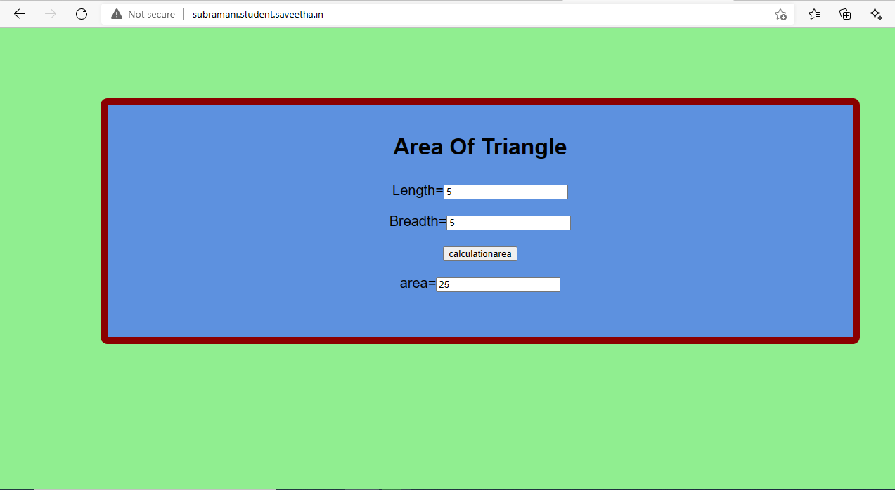

# Design a Website for Server Side Processing

## AIM:
To design a website to perform mathematical calculations in server side.

## DESIGN STEPS:
### Step 1:
Create a django project inside the pulled GitHub Repo.
### Step 2:
Insdie the project create a app called mathapp using command "sudo python3 manage.py startapp mathapp".
### Step 3:
Create a template folder inside mathapp and inside than create another folder called mathapp and inside that create a new file "area.html"
### Step 4:
Add the html conents in the area.html.
### Step 5:
Do the mathemical calculation in views.py and link the html tags.
### Step 6:
Link the html file through views.py in urls.py.
### Step 7:
Add mathapp to installed apps in setting.py and add necessary changes.
### Step 8:
Website Link :- http://subramani.student.saveetha.in/

## PROGRAM :
### area.html
~~~
<!DOCTYPE html>
<html>
<head>
    <meta charset='utf-8'>
    <meta http-equiv='X-UA-Compatible' content='IE=edge'>
    <title>area of triangle</title>
    <meta name='viewport' content='width=device-width, initial-scale=1'>
    <link rel='stylesheet' type='text/css' media='screen' href='main.css'>
    
</head>

<body>
    

<h1>Area Of Triangle</h1>   
<form method ="POST">
    
    
 
Length=<input type="text" name="length" value="{{l}}"></input> 
    

    
 
Breadth=<input type="text" name="breadth" value="{{b}}"></input> 
    

    
 
<input type="submit" value="calculationarea"></input> 
    

    
 
area=<input type="text" name="area" value="{{area}}"></input> 
    

</form>
</body>
</html>
~~~
### views.py
~~~
from django.shortcuts import render

# Create your views here.
def areacalculation(request):
    context = {}
    context["area"] = "0"
    context["l"] = "0"
    context["b"] = "0"
    if request.method == 'POST':
        l= request.POST.get('length','0')
        b= request.POST.get('breadth','0')
        area = int(l) * int(b)
        context["area"] = area
        context["l"] = l
        context["b"] = b

    return render(request,'myapp/area.html',context)

~~~
### urls.py:
~~~
"""subramani URL Configuration

The `urlpatterns` list routes URLs to views. For more information please see:
    https://docs.djangoproject.com/en/3.1/topics/http/urls/
Examples:
Function views
    1. Add an import:  from my_app import views
    2. Add a URL to urlpatterns:  path('', views.home, name='home')
Class-based views
    1. Add an import:  from other_app.views import Home
    2. Add a URL to urlpatterns:  path('', Home.as_view(), name='home')
Including another URLconf
    1. Import the include() function: from django.urls import include, path
    2. Add a URL to urlpatterns:  path('blog/', include('blog.urls'))
"""
from django.contrib import admin
from django.urls import path
from myapp import views

urlpatterns = [
    path('admin/', admin.site.urls),
    path('areaofrectangle/',views.areacalculation,name="areaofrectangle"),
    path('',views.areacalculation,name="areaofrectangle")
]

~~~

## OUTPUT:

## Result:
Thus a website is designed to perform mathematical calculations in server side and is hosted at
http://subramani.student.saveetha.in/

